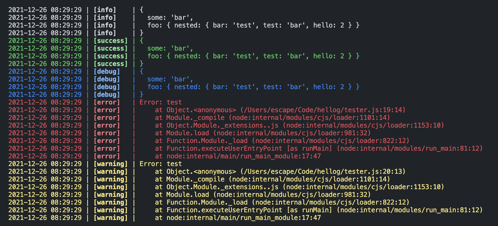

# hellog
*Your new logger !*

`hellog` is a general-purpose logging library. 

It offers a `console.log`-like API and formatting, colored lines and timestamps (or not if desired), all that with 0 dependencies.

## Get started

````js
const { Hellog } = require('hellog')

const logger = new Hellog();

const obj = {
  some: "bar",
  foo: {
    nested: { bar: "test", test: "bar", hello: 2 },
  },
}

logger.log(obj);
logger.success(obj);
logger.debug(obj)
logger.error(new Error("test"));
logger.warn(new Error("test"));
````



## Transport and options

### Console

This is the transport used by default.

````js
const { transports } = require('hellog')

const opts = {
  showLevel: true,
  timestamp: true
}

const transport = new transports.Console(opts)
````

#### Options

`timestamp` (`boolean`): *Whether or not to display the log time*

`showLevel` (`boolean`): *Whether or not to display the log level*